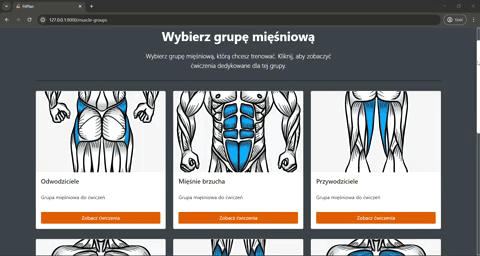

# FitPlan - zarządzaj swoimi treningami


**FitPlan** to nowoczesna aplikacja webowa stworzona w frameworku **Laravel**, zaprojektowana w celu ułatwienia zarządzania planami treningowymi i ćwiczeniami. Aplikacja pozwala użytkownikom na tworzenie i edytowanie spersonalizowanych planów treningowych, które można dostosować do indywidualnych celów i potrzeb. Dzięki prostemu i intuicyjnemu interfejsowi, użytkownicy mogą łatwo organizować swoje treningi, a także modyfikować je w miarę potrzeb. **FitPlan** łączy funkcjonalność z przyjaznym doświadczeniem użytkownika, umożliwiając skuteczne śledzenie postępów w treningach i osiąganie założonych celów.

---
## Spis treści

1. [Technologie](#Technologie)
2. [Instalacja](#Instalacja)
3. [Funkcjonalności](#Funkcjonalności)
4. [Wygląd strony](#Wyglad-strony)
5. [Autor](#Autor)

---
## Technologie

- **Laravel**  
  Framework PHP, który posłużył jako fundament projektu. Został wykorzystany do tworzenia backendu aplikacji, obsługi routingu, walidacji formularzy oraz interakcji z bazą danych.

- **Bootstrap**  
  Framework CSS użyty do szybkiego i estetycznego projektowania interfejsu użytkownika. Dzięki niemu aplikacja jest responsywna i przyjazna dla użytkownika.

- **CSS**  
  Dodano niestandardowe style, aby dostosować wygląd aplikacji tam, gdzie Bootstrap nie spełniał wymagań lub były potrzebne unikalne elementy wizualne.

---

## Instalacja

Jeśli nie masz zainstlowanego XAMPP'a zrób to i włącz apache oraz mysql.

1. **Sklonuj repozytorium:**

    Najlepiej umieść projekt w xampp/htdocks
   ```bash
   cd C:/xampp/htdocs

   git clone https://github.com/evee03/laravel-project.git

   cd laravel-project
   
   ```
2. **Zainstaluj zależności PHP:**

    ```bash
    composer install
    ```
3. **Skonfiguruj plik .env:**

    Skopiuj .env.exampe do .env
    ```bash
    cp .env.example .env
    ```
4. **Zaimportuj baze danych do XAMPP:**

    -Otwórz phpMyAdmin i utwórz nową bazę danych o nazwie fitplan_db

    -Przejdź do zakładki Import i wybierz plik który jest w folderze database/sql/fitplan_db
5. **Wygeneruj klucz aplikacji:**
    ```bash
    php artisan key:generate
    ```
    Dodaj go w APP_KEY w .env
6. **Uruchom serwer lokalny:**
    ```bash
    php artisan serve
    ```
    Aplikacja będzie dostępna pod adresem: http://localhost:8000.


## Funkcjonalności


- **Logowanie i rejestracja:** Założenie konta w celu stworzenia spersonalizowanych treningów, a także dodawanie do ulubionych.
- **Zarządzanie treningami:** Dodawanie, edytowanie i usuwanie treningów.
- **Baza ćwiczeń:** Przeglądanie dostępnych ćwiczeń wraz z ich filmami.
- **Planowanie:** Tworzenie planów treningowych dopasowanych do użytkownika.
- **Nowoczesny wygląd:** Frontend został zrobiony za pomoca bootstrapa oraz customowych elementów w CSS. Strona jest w pełni responsywna.

## Wygląd strony

| Strona Główna          | Walidacja          | Niepoprawne dane           |
|----------------------|---------------------|---------------------|
|  |  |  |

| Logowanie i Rejestracja        | Treningi        | Mięśnie i Ćwiczenia      | 
|----------------------|---------------------|---------------------|
|  |  |  |

| Widok po zalogowaniu         | Ulubione treningi        | Dodawanie treningu          |
|----------------------|---------------------|---------------------|
|  |  |  |

| Edycja i usuwanie       | Walidacja          | Niepoprawne dane           |
|----------------------|---------------------|---------------------|
|  |  |  |

---

## Autor

  Ewelina Musińska

 **Kontakt:** ewelina.musinska@gmail.com, https://github.com/evee03

---
