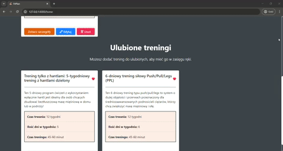

# FitPlan

<div align="left">
  
  <span style="font-size: 150px; font-weight: bold; vertical-align: middle;">FitPlan</span>
</div>


Strona webowa **FitPlan** służy do zarządzania planami treningowymi oraz ćwiczeniami, stworzone we frameworku Laravel. Aplikacja umożliwia użytkownikom tworzenie i edytowanie planów treningowych.

---
## Spis treści

1. [Instalacja](#Instalacja)
2. [Funkcjonalności](#funkcjonalności)
3. [Wygląd strony](#wyglad-projektu)
4. [Autor](#autor)

---

## Instalacja

Jeśli nie masz zainstlowanego XAMPP'a zrób to i włącz apache oraz mysql.

1. **Sklonuj repozytorium:**

    Najlepiej umieść projekt w xampp/htdocks
   ```bash
   cd C:/xampp/htdocs

   git clone https://github.com/evee03/laravel-project.git

   cd laravel-project
   
   ```
2. **Zainstaluj zależności PHP:**

    ```bash
    composer install
    ```
3. **Skonfiguruj plik .env:**

    Skopiuj .env.exampe do .env
    ```bash
    cp .env.example .env
    ```
4. **Zaimportuj baze danych do XAMPP:**

    -Otwórz phpMyAdmin i utwórz nową bazę danych o nazwie fitplan_db

    -Przejdź do zakładki Import i wybierz plik który jest w folderze database/sql/fitplan_db
5. **Wygeneruj klucz aplikacji:**
    ```bash
    php artisan key:generate
    ```
    Dodaj go w APP_KEY w .env
6. **Uruchom serwer lokalny:**
    ```bash
    php artisan serve
    ```
    Aplikacja będzie dostępna pod adresem: http://localhost:8000.


## Funkcjonalności


- **Logowanie i rejestracja:** Założenie konta w celu stworzenia personalizowanych pod siebie treningów, a także dodawanie innych do ulubionych.
- **Zarządzanie treningami:** Dodawanie, edytowanie i usuwanie treningów.
- **Baza ćwiczeń:** Przeglądanie dostępnych ćwiczeń wraz z ich filmami.
- **Planowanie:** Tworzenie planów treningowych dopasowanych do użytkownika.
- **Nowoczesny wygląd:** Frontend został zrobiony za pomoca bootstrapa oraz customowych elementów w CSS. Strona jest w pełni responsywna.

## Wygląd strony

| Strona Główna          | Walidacja          | Niepoprawne dane           |
|----------------------|---------------------|---------------------|
|  |  |  |

| Logowanie i Rejestracja        | Treningi        | Mięśnie i Ćwiczenia      | 
|----------------------|---------------------|---------------------|
|  |  |  |

| Widok po zalogowaniu         | Ulubione treningi        | Dodawanie treningu          |
|----------------------|---------------------|---------------------|
|  |  |  |

| Edycja i usuwanie       | Walidacja          | Niepoprawne dane           |
|----------------------|---------------------|---------------------|
|  |  |  |


<div align="center">

### Zdjęcia poglądowe

</div>

| Strona Główna          | Mięśnie & Ćwiczenia          | Treningi           |
|----------------------|---------------------|---------------------|
|  |  |  |

| Utwórz trening         | Profil         | 
|----------------------|---------------------|
|  |  | 

---

## Autor

  Ewelina Musińska

 **Kontakt:** ewelina.musinska@gmail.com, https://github.com/evee03

---
